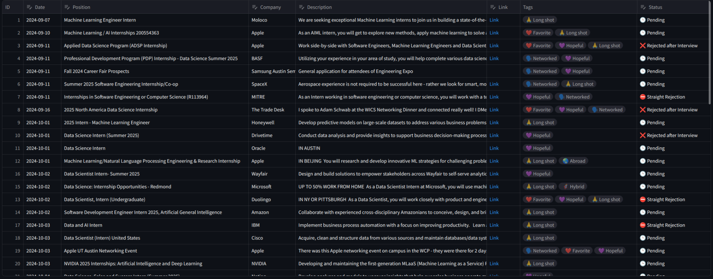
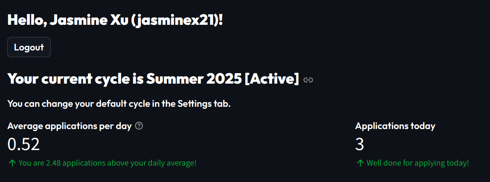
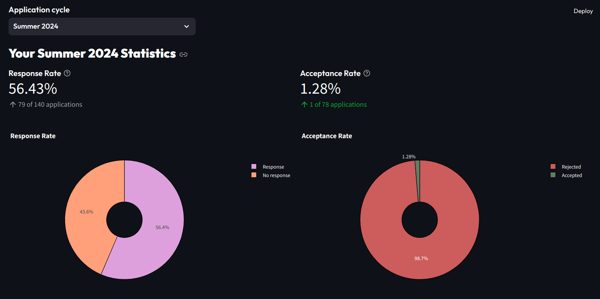
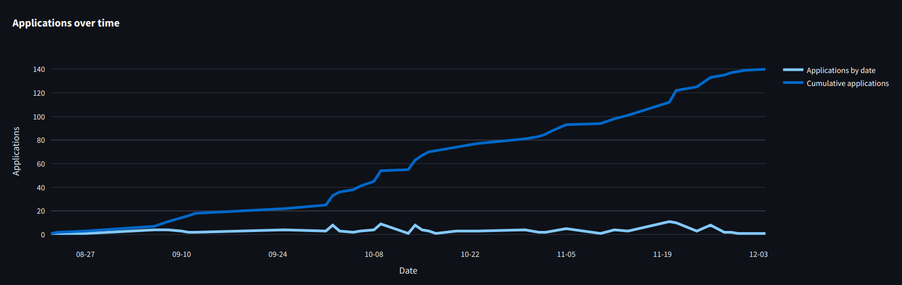

# Internship Database

A database to keep track of my internship applications and statuses, and to summarize cycle statistics. This is the second version of this project - the first one was built in R Shiny, whereas this one was built in Python (Streamlit).

#### The Database

#### Cycle Stats

---

### Future Steps
* Actually implement user authentication. It kind of works at the moment, but is more of a hard-coded way. Further explore `streamlit_authenticator`. 
* Figure out how to actually deploy the app so that users can access it beyond localhost. Ties in with user authentication - currently, I'm thinking of designing it such that once a user signs up, a folder is created on their machine, which contains the database. That might not be ideal, because if that folder is deleted, the database is gone. Not sure if there's any way of storing each user's database elsewhere as opposed to on their own machine, but worth a look.
* Add more stuff to the resources tab.
  * Initially I wanted to add an editable dataframe so that users can add their own resrouces, or add links to applications that they want to check out later, things like that. I believe I started it but had issues that I couldn't resolve. 
* Add more outcome-oriented stats; e.g. tags X and Y seem more predictive of you hearing back.